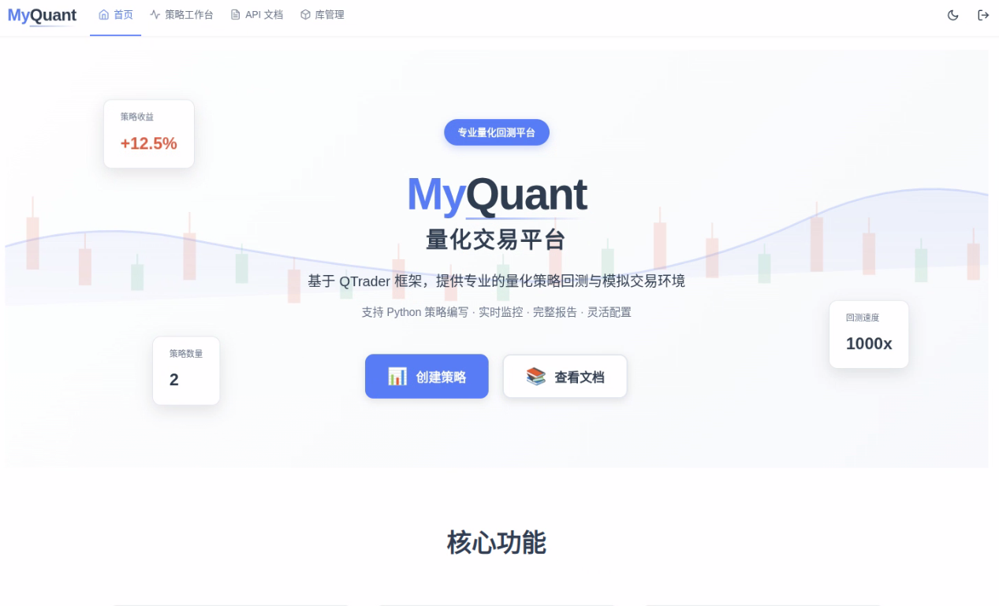
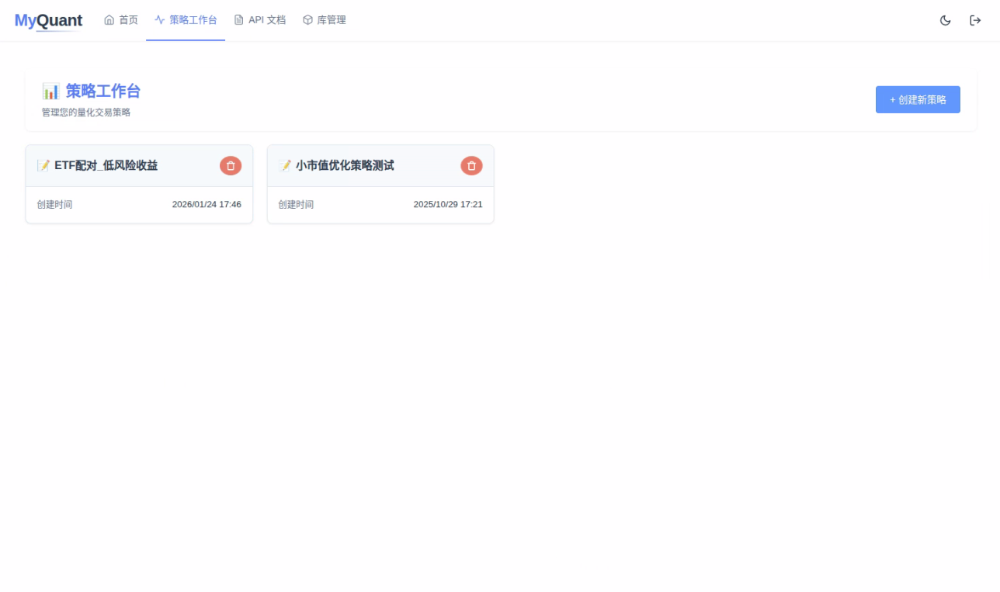
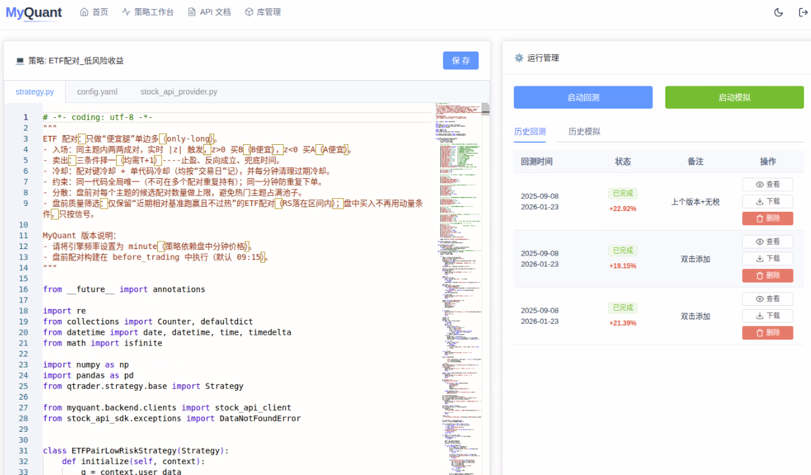
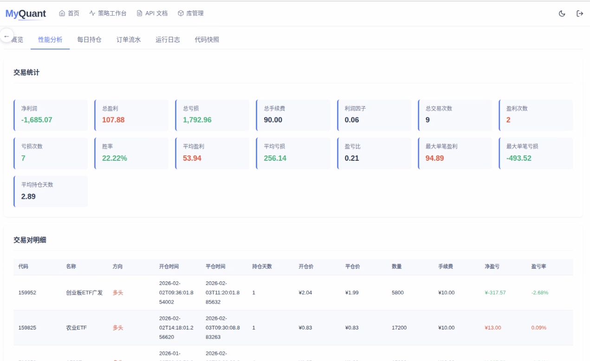
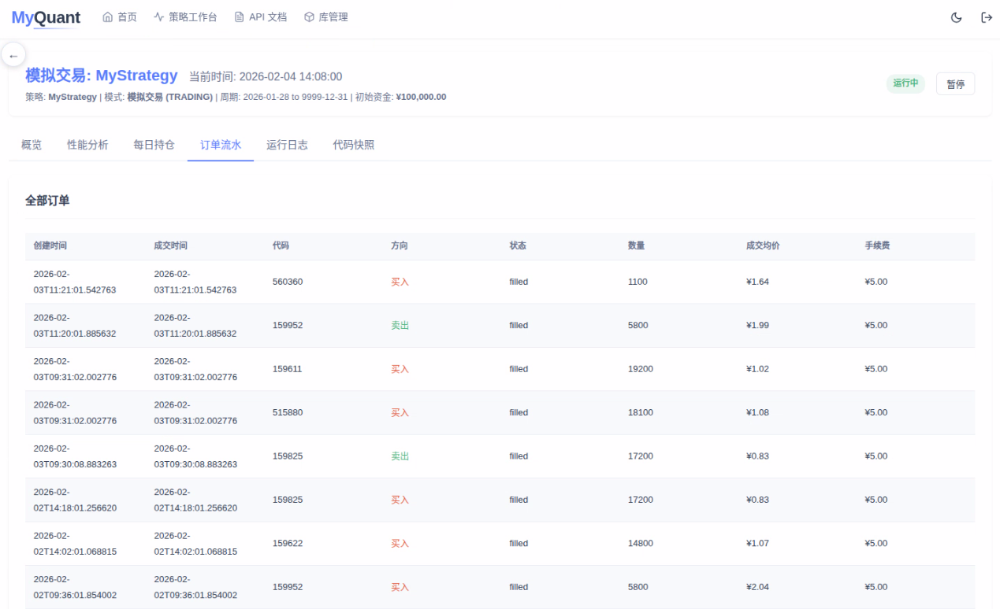

# MyQuant 🧩📊

> MyQuant 是一个面向 **QTrader** 的 WebUI：把策略开发、运行与回测产物管理做成“可视化工作台”。

- 🔗 **和 QTrader 的关系**：MyQuant 负责 UI/平台能力；回测/模拟执行由 QTrader 引擎完成
- 🔌 **数据接入方式**：通过 QTrader 的 `DataProvider`（数据合约）接入任意数据源
- 🧱 **可扩展**：围绕“策略 + 配置 + 数据提供者”三件套扩展能力（可做插件/模板体系）

---

## 功能一览 ✨

- 🗂️ 策略管理：创建/删除策略项目
- ✍️ 在线编辑：`strategy.py` / `config.yaml` / `data_provider.py`
- ▶️ 一键运行：回测 / 模拟盘
- ⏸️ 控制：暂停 / 继续 / 停止
- 🖥️ 监控：自动分配端口并嵌入 QTrader 内置监控页
- 📦 产物管理：报告、日志、workspace 文件浏览与下载
- 🧩 模板/插件思路：用模板生成策略骨架；可进一步把数据源、指标、报告样式做成插件

---

## 截图 🖼️







---

## 快速开始 🚀

### 1）准备环境

- Python >= 3.9
- Node.js >= 20

### 2）安装依赖

后端（建议虚拟环境）：

```bash
cd myquant
python -m venv .venv
source .venv/bin/activate
pip install -U pip
pip install -r requirements.txt

# 安装 qtrader（回测/模拟引擎）
pip install -e ../pqtrader
```

前端：

```bash
cd frontend
npm install
```

### 3）配置

```bash
cp myquant_config.example.json myquant_config.json
```

### 4）启动

后端：

```bash
python backend/app.py
```

前端：

```bash
cd frontend
npm run dev
```

访问：`http://localhost:5173`

---

## 运行一个回测（平台内）✅

1. 打开 MyQuant → 新建策略
2. 策略目录会生成 3 个核心文件：
   - `strategy.py`：策略逻辑（生命周期钩子）
   - `config.yaml`：回测/模拟参数（频率、日期、费用、监控端口等）
   - `data_provider.py`：数据提供者（实现数据合约）
3. 点击运行（Backtest / Simulation）

---

## DataProvider（数据合约）🔌

MyQuant 不关心数据来自哪里，它只要求你兑现 QTrader 的数据合约（接口见 `qtrader.data.interface.AbstractDataProvider`）。

必须实现 3 个方法：

- `get_trading_calendar(start, end)`：交易日历
- `get_current_price(symbol, dt)`：某时刻价格快照（至少包含 `current_price`）
- `get_symbol_info(symbol, date)`：标的静态信息（名称、是否停牌）

仓库提供了一个可直接改造的 Mock 模板：`templates/data_provider.py`。

---

## 插件/扩展（建议的落地方式）🧩

MyQuant 的扩展点建议围绕下面三类“可插拔对象”沉淀：

- **策略模板**：不同策略类型（择时/选股/对冲）对应不同脚手架
- **数据提供者模板**：CSV/SQLite/REST API/你自己的数据服务
- **报告与可视化**：自定义指标面板、报表模板、对比分析

这些扩展点不需要改 QTrader 核心，只需要在 MyQuant 层管理文件与运行参数即可。

---

## 文档 📚

- 平台使用说明：`docs/user_guide.md`
- UI/UX 设计说明：`docs/MyQuant_UI_UX_Design_Guide.md`
